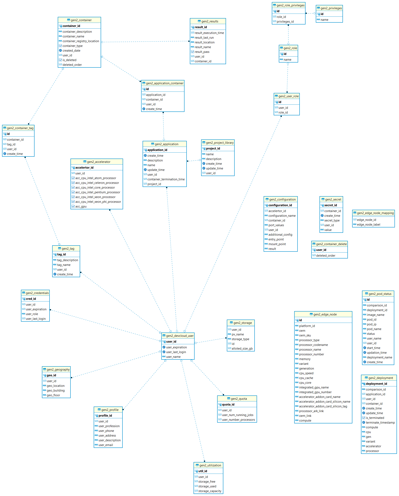

# Spring Tasks
- How to deal with profiles.

# BYOC

## pom.xml

### Spring Cloud
- guava
- spring cloud

### Dependencies
- springfox : swagger
- org.json : classes that are used to parse and manipulate JSON in Java.
	- JSONObject and JSONArray
	- It's biggest weakness is that it requires you to load the entire JSON document into a string before you can parse it. For large JSON documents this may be inefficient.
	- Why have this and GSON?
- jaxb-api : XML
- javassist : bytecode manipulation?
- thymeleaf : serving XHTML/HTML5 at the view layer of MVC-based web applications (Why?)
- devtools : LiveReload
- jjwt : Java JSON Web Token
- nimbus-jose-jwt : Java and Android library for JSON Web Tokens 
- gson : JSON Parsing
- json-smart : JSON Parsing (Why have so many json parsers?)
- commons-lang3 : full-featured package of utility classes, aimed at extending the functionality of the Java API.
	- StringUtils
	- ArrayUtils
	- ConstructorUtils
	- FieldUtils
	- MethodUtils 
- httpclient :

### build 
- spring-boot-maven-plugin

## Config

### Hikari Connection Pool (From spring-boot-starter-data-jpa )
- Hikari is a JDBC DataSource implementation that provides a connection pooling mechanism. Compared to other implementations, it promises to be lightweight and better performing.
### non_contextual_creation = true
- This entry is put just to avoid a warning message in the logs when you start the spring-boot application
### Configuration Microservice

### openshift-int-ms

### spring.datasource.initialization-mode=always??
Have to set always to load sql script files, automatically loads schema.sql and data.sql from classpath. You can switch this value to never to not initialize.

	

## Questions
- Is it the right hierarchy : Project > Application > Service > Pods > Container > Container can have multiple tags?
- Why is there a ManyToMany relationship between application and container?
- Where to update the schema? Is Schema.sql still in use?
- In some places the dto are in model why?
- Is it database per microservice or schema per microservice or just all in one schema?
- What is deployment?
- Edge?
- Where is the devcloud edge gen2?
