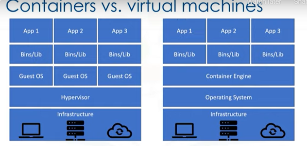

# Docker
- Docker is a software platform for building and running applications as containers.
- Provided a very straightforward way to build application as containers.

## Docker Image
- Image built using docker technology
- These are immutable.

## Docker Container
- Lightweight executable unit of software in which application code is packaged along with all it's dependencies.
- Containers use virtualization to achieve this.
- Containers use the host OS kernel.
- For linux kernel : Namespaces and cgroups are the used to enable virtualization.
- Very useful for microservice architecture.
- A writable layer is added when an image is run as a container.

### Virtual Machine vs Containers

- Containers virtualize the OS rather than infrastructure hardware as is done by the containers.

# Container Runtime
- Traditionally, a computer programmer might know "runtime" as either the lifecycle phase when a program is running, or the specific implementation of a language that supports its execution.
- A container runtime is responsible for all the parts of running a container that isn't actually running the program itself.
- Responsible for running and downloading images.

# Vunerability Advisor
- Scans images for common vunerability and exposures.

# Docker File

## FROM 
- Define Base Image
- First command

## RUN
- Execute commands arbitrarly.

## ENV
- Set env variable

## ADD AND COPY
- Copy files and directories
- ADD Can also copy from remote repositories

## CMD
- Define default command for container execution.
- Only one per docker file  

# Docker Registry
- Store named images
- Hosted vs Self Hosted
- Public vs Private

## Push Image
- Store an Image

## Pull Image
- Download an Image

## Image Name
- hostname/repository:tag 
- docker.io/ubuntu:18.04

# Docker Commands
## docker build
- Creates images
- Requires dockerfile
- Let's you tag images
- t is for tag below.
- ```docker build -t my_app:v1 .```

## docker tag
- Name/Tag an existing image.
- Won't overwrite the exisiting image.
- It will just tag the existing image with new tag. Won't create a new image.

## docker image
- list all images and their details

## docker run
- Used to run a container 

## docker pull/push
- Storing and retrieving images from remote repository


# Question
