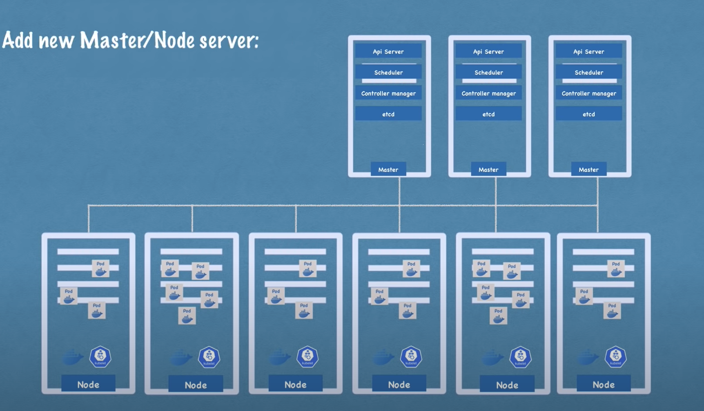
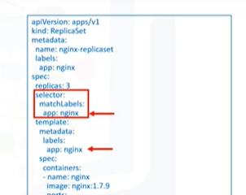

# Architecture

## Nodes
- Physical Machine or VM
### Master Node
- There can be multiple master node, where API Server would be load balanced and etcd database will be distributed.
Has 4 services

#### API Server
- Entry point for Cluster.
- Gatekeeper for authentication.
- Developer interacts with k8s using an API Server
- Client can be kubectl or k8s dashboard.

#### Scheduler
- Which worker node should the next pod/component will be scheduled based on available resources.
- Only decides where to schedule, the kubelet is responsible for starting the pod.

#### Controller Manager
- Health checks and status change
- If pods crash, then it sends the request schedulers which will send request to kubelet in the node to create pods.

#### etcd
- Key value store of the cluster.
- Memory of the cluster or cluster brain.
- Application data is not stored in the etcd. 

### Worker Nodes
- Needs to have following dependies
  - Container Runtime (Say, Docker)
  - kubelet : (Kubernetes Process interacts with container runtime and node)
    - Starts the pod inside a node with container inside.
  - Kubeproxy : Forwards request from services to pods.

## Pod
- Abstraction over the container, so kubernetes don't have to interact with one particular runtime(docker), and can be used for multiple other container runtime.
- A pod has a separate network interface i.e IP address.
- Smallest unit in k8s. Can be replicated for scaling up.

```yaml
apiVersion:v1
kind:Pod
metadata:
	name:nginx
spec:
	containers:
	- name : nginx
	- image : nginx:1.7.9
      ports :
	  - containerPort : 80 
```

## Service
- Smart Load Balancer for Pod
  - Avoids network overhead
  - Forwards to pod with less utilization.

## Ingress
- External Load Balancer

## Configuration

### ConfigMap
- Create a config map by specifying the key value pair using create kubctl command.
- Yaml file will then point to the configMap in the env section
- Config map can also be created using the properties file.
### Secrets

## Deployment
- Deployment of stateless app
- Provides 	management for pods and replica set.;
- More robust than replica set.

## Replica Set
- Group of identical pods that are running.
- Managing the replicas of the pods
- Replica Set is used to scale up and down pod.
- has replicas field to increase or decrease the pods number.
- Don't have to deal with this replica set directly. Deployment are used instead to deal with replicaset.

## Stateful Set
- Deployment of databases which has state
- Common practice to not include database in the k8s cluster.


## Namespace
- Virtualization of a physical cluster.
- Each object has a unique name for a resource type inside a namespace.

## Labels
- Key value pair attached to objects.
- Not unique

## Selector
- Uses labels.
- Used by controller to select group of k8s object.
-  As we can see below, replica set selector has a reference to label of pod.


## Horizontal Pod Autoscaler
- Scale up or down based on demand.
- HPA Can be configured such that average metrics if fall above or below then it will scale up or down.
  - min
  - max
  - cpu-percent

## Liveness and Readiness Probe
- Kubernetes uses liveness probes to know when to restart a container. Kubernetes uses readiness probes to decide when the container is available for accepting traffic.
- liveness probes could catch a deadlock, where an application is running, but unable to make progress. Restarting a container in such a state can help to make the application more available despite bugs.
- The periodSeconds field specifies that the kubelet should perform a liveness probe every 5 seconds. The initialDelaySeconds field tells the kubelet that it should wait 5 seconds before performing the first probe

## Rolling Updates
- add liveness and readiness probes to your deployment.yaml.
- Rolling update strategy to yaml file.
- maxUnavailable is an optional field that specifies the maximum number of Pods that can be unavailable during the update process. The value can be an absolute number (for example, 5) or a percentage of desired Pods (for example, 10%). The absolute number is calculated from percentage by rounding down. The value cannot be 0 if maxSurge is 0. The default value is 25%.
- maxSurge : Creating new pods to ensure availability.
- maxSurge is an optional field that specifies the maximum number of Pods that can be created over the desired number of Pods. The value can be an absolute number (for example, 5) or a percentage of desired Pods (for example, 10%). The value cannot be 0 if MaxUnavailable is 0. The absolute number is calculated from the percentage by rounding up. The default value is 25%.

# commands

## Declarative Commands are a benifit.
- Apply command is declarative.
 
## Kubectl commands
- ```kubectl config get-clusters```
- ```kubectl config get-contexts```
- ```kubectl version```
- ```kubectl top {pod_name}```
- ```kubectl get nodes```
- ```kubectl get pods```
- ```kubectl get pod -o wide (More details)```
- ```kubectl get services```
- ```kubectl get deployment```
- ```kubectl create deployment nginx-depl --image=nginx```
- ```kubectl apply -f deployment.yaml```
- ```kubectl edit deployment nginx-depl```
- ```kubectl logs {pod-name}```
- ```kubectl exec --stdin --tty {pod-name} -- /bin/bash```
- ```kubectl describe pod pod-name```
- ```kubectl delete deployment mongo-depl```
- ```rollout status deployment```
- ```rollout undo deployment_name```
## minikube commands
- ```minikube start```
- ```minikube delete```
- ```minikube status```
- ```minikube delete -all```

